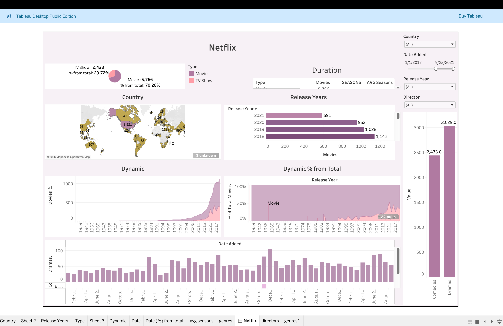

# netflix-tableau-dashboard

------------------------------------------------------------------------------------------------

This project explores Netflix's content strategy by analyzing the distribution of movies and TV shows across time and geography. The dashboard highlights key trends in content growth, regional production, and shifts in release patterns.

By incorporating interactive filtering, users can dynamically assess how content vaires across dimensions such as country, release year, and director, supporting data-driven insights into platform expansion and content investment strategies. 

-------------------------------------------------------------------------------------------------

### Business Use Case

This dashboard can be used by content strategy teams to identify high-performing regions, monitor content growth trends, and inform future content investment decisions. 

--------------------------------------------------------------------------------------------------

### Dashboard Preview

